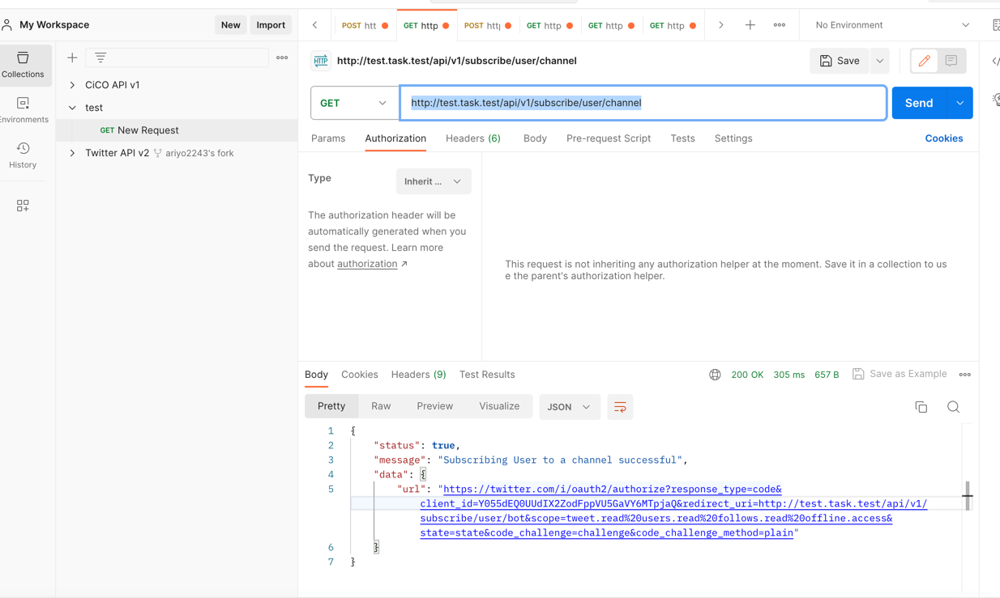
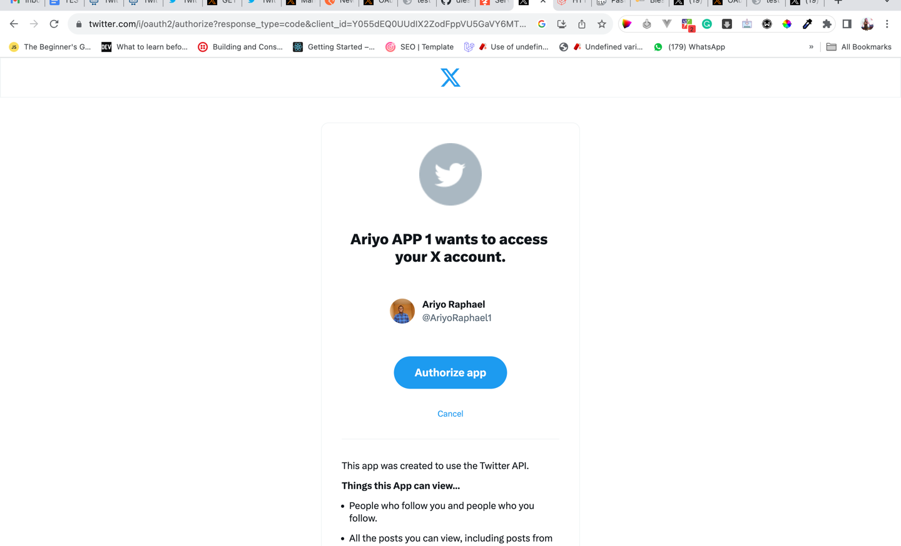
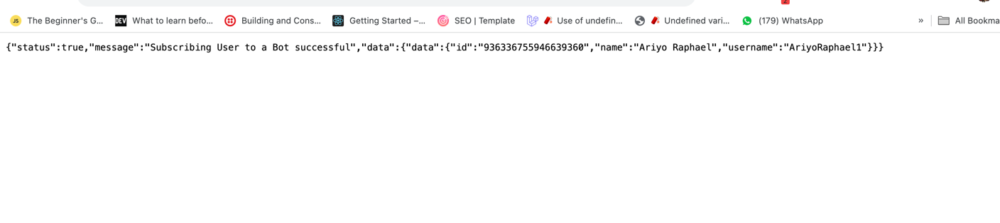
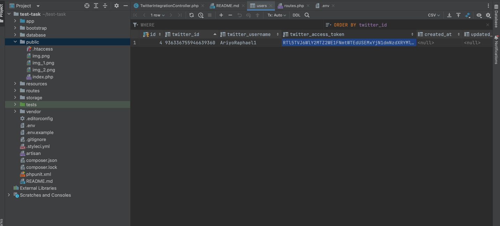

# Twiter Oauth integration for PHP developer (Laravel + REST API)

## Installation

# Clone the repository
git clone git@github.com:Soft-Raph/twitter-task-test.git

# Install dependencies
### composer install

### Configure your .env file

### run php artisan migrate

#### Start by adding your 'CLIENT_ID' and 'CLIENT_SECRET' to your .env file.

#### The first endpoint, 'http://test.task.test/api/v1/subscribe/user/channel,' will generate a URL for OAuth2 authorization. This URL allows subscribers to subscribe to a channel.

#### The second endpoint which is 'http://test.task.test/api/v1/subscribe/user/bot', it is the callback url that will return with the 'code' to get 'access_token' for subscriber, which makes the subscriber subscribe to the bot, and the necessary information will be store to the user database. 

#### The third endpoint is for sending direct messages to subscribers. It requires the 'participant_id' (subscriber's Twitter ID) and the text to be sent. Note that this feature requires an upgraded version of the Twitter API.
some screenshot below

